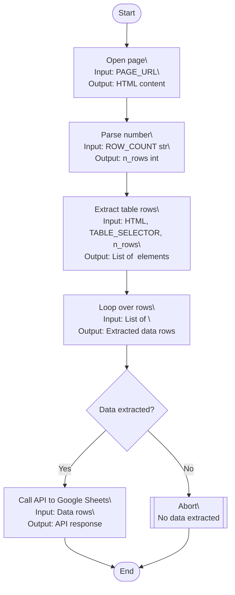

# Wikipedia FIFA World Cup Finals Extractor

This project extracts FIFA World Cup finals data from Wikipedia and appends it to a Google Sheet using the Google Sheets API.

## Features
- Configurable Wikipedia source and table selector
- Extracts Year, Winner, Score, Runners-up for first N finals
- Appends data to Google Sheets via API
- All settings via `.env` file

## Setup
1. Clone the repo and install dependencies:
   ```bash
   uv add -r requirements.txt
   ```
2. Create a `.env` file (see `.env` example in repo).
3. Run the main script:
   ```bash
   python -m wikipedia_parser.main
   ```

## Docker Usage
Build and run the container:
```bash
docker build -t wikipedia-parser .
docker run --env-file .env wikipedia-parser
```

## Project Structure
- `wikipedia_parser/` — Source code package
- `tests/` — Unit tests (to be added)
- `.env` — Environment variables
- `requirements.txt` — Python dependencies
- `README.md` — Project documentation

## Workflow Flowchart (Mermaid)



### Step Details

- **Open page**
  - Input: `PAGE_URL` (from .env)
  - Output: HTML content of the Wikipedia page
- **Parse number**
  - Input: `ROW_COUNT` (string, from .env)
  - Output: Integer number of rows to extract
- **Extract table rows**
  - Input: HTML, `TABLE_SELECTOR`, `n_rows`
  - Output: List of `<tr>` elements (table rows)
- **Loop over rows**
  - Input: List of `<tr>` elements
  - Output: List of extracted data rows (Year, Winner, Score, Runners-up)
- **Detour**
  - If no data is extracted, abort the process
- **Call API (Google Sheets)**
  - Input: Extracted data rows (including header)
  - Output: API response (success or error)

### API POST Request Details

- **URL:**
  - `https://sheets.googleapis.com/v4/spreadsheets/{SPREADSHEET_ID}/values/{RANGE}:append`
- **Method:**
  - POST
- **Headers:**
  - `Authorization: Bearer {ACCESS_TOKEN}`
  - `Content-Type: application/json`
- **Params:**
  - `valueInputOption=RAW`
- **Body:**
  ```json
  {
    "values": [
      ["Year", "Winner", "Score", "Runners-up"],
      ["1930", "Uruguay", "4–2", "Argentina"],
    ]
  }
  ```


## Configuration
All configuration is in `.env`.
Reference Sheet : https://docs.google.com/spreadsheets/d/1YyZbgnCtCcQDcpCXlg8b066KL6mq_R3l8pu4PJ2wPq8/edit?usp=sharing

## License
Apache
